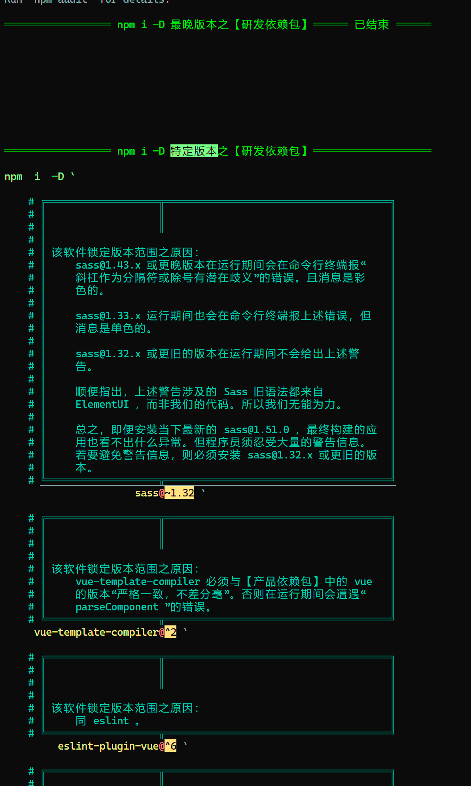

<link rel="stylesheet" href="./文档集/文档的样式/wulechuan-styles-for-html-via-markdown--vscode.default.min.css">


# npm 包研发项目辅助性命令行工具集

> 中国人——特别是汉族人，理应坚持广泛、规范地使用汉语。凡非必要之情形不说外国话、不用外国字。此乃天经地义！然则每当必要，亦不排斥采用外国之语言。不妨 **博世界之学问，养中国之精神** 。
>
> 本人亦支持少数民族坚持采用自己民族的传统语言。仍须强调，凡中国人，皆应会用汉语、积极使用汉语，此乃中华各民族之大一统之必由。


## NPM 页

<dl>
<dt>NPM 包名</dt>
<dd>

[@wulechuan/cli-scripts--npm-project-helpers](https://www.npmjs.com/package/@wulechuan/cli-scripts--npm-project-helpers)

</dd>
<dt>作者</dt>
<dd><p>南昌吴乐川</p></dd>
</dl>

## 源代码仓库

| <span style="display:inline-block;width:10em;">提供仓库服务之组织</span> | <span style="display:inline-block;width:10em;">仓库组织之国别</span> | 仓库地址 |
| ------------- | :----------: | ------- |
| 码云           | 中华人民共和国 | [https://gitee.com/nanchang-wulechuan/wulechuan--cli-scripts--npm-project-helpers.git](https://gitee.com/nanchang-wulechuan/wulechuan--cli-scripts--npm-project-helpers.git) |
| 阿里云之代码仓库 | 中华人民共和国 | [https://code.aliyun.com/wulechuan/wulechuan--cli-scripts--npm-project-helpers.git](https://code.aliyun.com/wulechuan/wulechuan--cli-scripts--npm-project-helpers.git) |
| GitHub         | 美           | [https://github.com/wulechuan/wulechuan--cli-scripts--npm-project-helpers.git](https://github.com/wulechuan/wulechuan--cli-scripts--npm-project-helpers.git) |


## 简介

### 言简意赅版

本工具集之主体是一些处于雏形状态的命令行工具，有【PowerShell】和【类 Bash】两类。我们对这些雏形稍加修改，它们即可如期运转。**它们的功用是辅助某 npm 项目以“贪婪地”升级该 npm 项目的各依赖包之版本。**

本工具略显复杂。保持该复杂性旨在贯彻“代码即文档”的理念。参见下文《[运行截屏](#运行截屏)》。

特别的，本工具集安装伊始，其内建的 JavaScript 程序会还自动为这些工具设计配套的 VSCode 任务，这为 VSCode 用户提供了方便。


#### 运行截屏

1.  
1.  
1.  
1.  
1.  

如果图片加载太慢，或干脆打不开。不妨改为在以下地方查阅这些图片。

-   中国大陆境内者推荐查阅《码云》上存放的图片。

    1.  《[吴乐川的_npm_项目依赖包管理工具运行截屏_2022-05-26_01](https://gitee.com/nanchang-wulechuan/wulechuan--cli-scripts--npm-project-helpers/blob/master/文档集/插图集/吴乐川的_npm_项目依赖包管理工具运行截屏_2022-05-26_01.png)》，
    1.  《[吴乐川的_npm_项目依赖包管理工具运行截屏_2022-05-26_02](https://gitee.com/nanchang-wulechuan/wulechuan--cli-scripts--npm-project-helpers/blob/master/文档集/插图集/吴乐川的_npm_项目依赖包管理工具运行截屏_2022-05-26_02.png)》，
    1.  《[吴乐川的_npm_项目依赖包管理工具运行截屏_2022-05-26_03](https://gitee.com/nanchang-wulechuan/wulechuan--cli-scripts--npm-project-helpers/blob/master/文档集/插图集/吴乐川的_npm_项目依赖包管理工具运行截屏_2022-05-26_03.png)》，
    1.  《[吴乐川的_npm_项目依赖包管理工具运行截屏_2022-05-26_04](https://gitee.com/nanchang-wulechuan/wulechuan--cli-scripts--npm-project-helpers/blob/master/文档集/插图集/吴乐川的_npm_项目依赖包管理工具运行截屏_2022-05-26_04.png)》，
    1.  《[吴乐川的_npm_项目依赖包管理工具运行截屏_2022-05-26_05](https://gitee.com/nanchang-wulechuan/wulechuan--cli-scripts--npm-project-helpers/blob/master/文档集/插图集/吴乐川的_npm_项目依赖包管理工具运行截屏_2022-05-26_05.png)》。

-   存放于《集得中心》上的图片。

    > 鄙人所谓【集得中心】，即外国话 GitHub 。

    1.  《[吴乐川的_npm_项目依赖包管理工具运行截屏_2022-05-26_01](https://github.com/wulechuan/wulechuan--cli-scripts--npm-project-helpers/blob/master/文档集/插图集/吴乐川的_npm_项目依赖包管理工具运行截屏_2022-05-26_01.png)》，
    1.  《[吴乐川的_npm_项目依赖包管理工具运行截屏_2022-05-26_02](https://github.com/wulechuan/wulechuan--cli-scripts--npm-project-helpers/blob/master/文档集/插图集/吴乐川的_npm_项目依赖包管理工具运行截屏_2022-05-26_02.png)》，
    1.  《[吴乐川的_npm_项目依赖包管理工具运行截屏_2022-05-26_03](https://github.com/wulechuan/wulechuan--cli-scripts--npm-project-helpers/blob/master/文档集/插图集/吴乐川的_npm_项目依赖包管理工具运行截屏_2022-05-26_03.png)》，
    1.  《[吴乐川的_npm_项目依赖包管理工具运行截屏_2022-05-26_04](https://github.com/wulechuan/wulechuan--cli-scripts--npm-project-helpers/blob/master/文档集/插图集/吴乐川的_npm_项目依赖包管理工具运行截屏_2022-05-26_04.png)》，
    1.  《[吴乐川的_npm_项目依赖包管理工具运行截屏_2022-05-26_05](https://github.com/wulechuan/wulechuan--cli-scripts--npm-project-helpers/blob/master/文档集/插图集/吴乐川的_npm_项目依赖包管理工具运行截屏_2022-05-26_05.png)》。


### 冗长版

#### 由来

本人研发 npm 项目时，常常会“贪婪地”升级该 npm 项目的各种依赖包的版本。

-   于其中一些依赖包，即便是进行了主版本的升迁，例如 eslint 从 `v7.x.x` 升级至 `v8.19.0`，我们自己的 npm 项目也会“很幸运的”照常运转。

-   但另有一些依赖包，如果升级至过于晚近的版本，例如 chalk 从 `v4.x.x` 升级至 `v5.0.0`，则会令我们自己的 npm 项目无法运转。遂应令这些依赖包之版本保持在某个较旧的版本上或某个版本范围内。换句话说，这些包的版本有上限约束。

在追求上述目标时，会遇到以下问题：

-   欲“贪婪地”升级各种依赖包时， `npm up` 命令是达不到目的的，因为该命令过于保守。

-   当一股脑采用 `npm i 包名@latest` 时，又无法妥善处理那些须遵守版本上限约束的依赖包。

故本人在几乎所有本人私有的或由本人主导的 npm 项目中都随附了专门的命令行脚本，用以分门别类依照不同策略（贪婪或守限）管理这些依赖包的**安装任务**。久而久之，提炼成形，汇于本工具集中。


#### 特点与价值


诚然，完成上述任务（即指贪婪或守限地升级依赖包）完全可以撰写一些简朴实用的脚本做到。**总共也要不了几行命令。** 例如：

```bash
# Bash 或 PowerShell

# 下方这些例子纯属虚构。
# 还需注意， npm 不允许包名包含我汉字！

npm i    甲@latest 乙@latest 丙@latest
npm i -D 戊@latest 已@latest

npm i    庚@1.2.3 辛@4.5.6
npm i -D 壬@3.2.1 鬼@9.8.7
```

其实本工具集的早期雏形就是这样的简易脚本。

然而，

-   一方面，每当上述多个命令顺次执行时，它们的输出既不够美观，也不可一目了然。于我这种吹毛求疵的人而言，此种“简约之美”往往是不可接受的。
-   另一方面，每当某依赖包须坚守在某版本范围内时，我们应说明缘由。否则该项目的其他参与者或接手者也难以理解。

为使命令行工具的界面信息美观、易读，也为了令其输出有价值的交代信息，以便我和“*潜在的合作者*”交流或交接，我在日常研学中逐渐形成了一些辅助性工具，汇集于此。

如你所猜想的一般，本工具集不论是配置方法还是运行过程，均侧重令各命令在运行环境中提供足够的信息，并令这些信息较为美观。因此，**本工具集有“实用价值不高”之嫌，但它们满足了我个人的癖好。**

须注意，本套工具之主体均非采用 JavaScript 语言族编写，而是采用 2 种命令行环境之语言编写，即 PowerShell 语言和 Bash 语言。**故本工具集之主体仅用于（多种）命令行环境。**

还须注意，虽然本套工具之主体并非 JavaScript 程序，但本工具集确实内建了一些有价值的 JavaScript 程序。每当其他 npm 包（暂称**甲**）安装完本工具集之际，本工具集内建的那些 JavaScript 程序会自动改动甲的环境配置，例如：

-   将作为本工具集主体的**工具雏形**复制到甲中的特定文件夹内。

    > 这些雏形均为命令行脚本（PowerShell 与 Bash）文件。之后，按甲之具体要求对这些雏形稍加修改，它们即可运转。

-   构建一些实用的 VSCode 任务，以配合上述实用工具。

以上种种许令甲更方便的利用本工具集。


#### 本工具集之主体在运行时的任务清单

每当允许本工具集中的主体工具（即命令行脚本程序）时，它将依次完成以下任务：

> 注意，下文所谓“当前 npm 项目”，亦可称“你的 npm 项目”，以区别本工具集。此即是说，所谓“当前 npm 项目”安装并利用本工具集。

1.  如果配置允许，**删除当前文件夹内的 `node_modules` 文件夹** 。

    > 注意，默认配置即允许本程序删除之。

1.  如果配置允许，**删除当前文件夹内的 `package-lock.json` 文件** 。

    > 注意，默认配置即允许本程序删除之。

1.  依照预先配置，安装当前 npm 项目的【**产品级**】依赖包中凡 **安装版本不设限者** 。

    > 注：所谓【产品级】依赖包，即是指列示在当前 npm 项目自身的 `package.json` 中的 `dependencies` 条目中的一切子条目。
    >
    > 安装它们时采用的命令是 `npm  install  --save-prod`。亦可简写为 `npm  i -P`。

1.  依照预先配置，安装当前 npm 项目的【**产品级**】依赖包中凡 **安装版本须设限者**。


1.  依照预先配置，安装当前 npm 项目的【**研发级**】依赖包中凡 **安装版本不设限者**。

    > 注：所谓【研发级】依赖包，即是指列示在当前 npm 项目自身的 `package.json` 中的 `devDependencies` 条目中的一切子条目。
    >
    > 安装它们时采用的命令是 `npm  install  --save-dev`。亦可简写为 `npm  i -D`。

1.  依照预先配置，安装当前 npm 项目的【**研品级**】依赖包中凡 **安装版本须设限者**。

1.  如果存在与“ **更新与研发相关的数据库** ”有关之任务，则执行这些任务。须知，这些任务由当前 npm 项目的维护者自由设计。本工具集仅提供较美观的提示信息，别无其它。

1.  如果存在与“ **其他交代** ”有关之任务，则执行这些任务。须知，这些任务由当前 npm 项目的维护者自由设计。本工具集仅提供较美观的提示信息，别无其它。


由上可见，为当前 npm 项目安装或更新 npm 依赖包是本工具集之主要任务。它将当前 npm 项目的各色依赖包**分为四个种类，依次分批安装之，每类一批**。

要将依赖包归为这四类之一，须事先做一点配置工作。针对本工具集的 Bash 版本和 PowerShell 版本的工具的配置工作是略有区别的，如下：

-   PowerShell 语言强大而灵活，故本工具集在第 `v1.0.0` 版中，采用 PowerShell 语言的工具就已经实现了“描述性”的配置，而将处理该配置的逻辑细节统统隐藏。非但如此，本工具集在安装完成之际，会借助内部的 JavaScript 程序**自动**扫描当前 npm 项目的 `package.json` 文件，并将这些信息与本工具提供的范本（或者说雏形）结合起来，构建出真正实用的 PowerShell 脚本。

    如果你的项目不会频繁变更依赖包之集合，那么该自动产生的 PowerShell 脚本令你近乎“无”劳永逸。

-   自本工具 `v2.0.0` 始，Bash 语言书写的工具也实现了“描述性”的配置。且本工具内部的 JavaScript 程序同样会自动产生实用的 Bash 脚本。

    > 比 PowerShell 版的脚本工具更妙的是，每当所谓“当前 npm 项目”的依赖包列表发生变动后，如果再次运行本工具集提供的 JavaScript 辅助工具，则“当前 npm 项目”中业已存在的 Bash 脚本会自动修订以反映当前 npm 项目的依赖包之变动。只是，`v2.0.0` 版暂无来得及提供方便的途径做到 “再次运行那些 JavaScript 辅助工具”。直白的说，再次运行那些脚本的方法较为麻烦，有待日后演进出更佳的方案。
    >
    > 目前，每当当前 npm 项目之依赖包变动后，要令本工具集内建的 JavaScript 工具自动修订 Bash 工具集，可以这样做：删除当前项目的 `node_modules` 文件夹，并执行 `npm i` 。因为为当前 npm 项目重新安装各依赖包时，自然也会安装本工具集，此时，本工具集内建之 JavaScript 会执行一次。故而，当前 npm 项目中实用的本工具集中的 bash 脚本即会得到修订。

## 安装与使用

### 安装

本工具集虽然运行在命令行环境（【PowerShell】 或【类 Bash】），但**专门服务于各色 npm 项目，且其自动化安装和部署之功能也有赖于 npm** 。自然的，本人令本工具集依托 npm 发行。故安装本工具集也应当借助 npm 。

> 脱离 npm 来安装本工具集之方法无实用价值。从略。

依托 npm 服务框架来安装本工具集之步骤如下：

1.  确保你的计算机或你的容器（例如 Docker Container）中已经安装了 Nodejs。见《[Nodejs 官方下载页](https://nodejs.org/zh-cn/download/)》。

1.  虽然 Nodejs 往往会随附一个名为 npm 的工具。但是，一来此事并不一定（例如 Ubuntu 环境的 Nodejs 有可能并不附带 npm）；二来即便 Nodejs 附带了一份 npm，该 npm 之版本也未必最新的。**故而，推荐于此时机安装 _最新版_ 的 npm 。**

    - 以下方法假定你所安装的 Nodejs 确实随附了一份 npm，并利用该随附的、较旧版本的 npm 来安装最新版的 npm 。

        ```bash
        # Bash 或 PowerShell
        npm  i  -g  npm
        ```

    - 以下假定在 Ubuntu 系统安装 Nodejs 之后， npm 仍未安装。从零开始安装 npm 的步骤如下。

        ```bash
        apt  update
        apt  install  npm
        ```


1.  借助 `cd` 命令来到你的项目**根**文件夹，再用以下命令将你的项目初始化成一个 npm 项目。

    ```bash
    # Bash 或 PowerShell
    npm  init  -y
    ```

    > 具体而言，npm 将在该文件夹内创建一个文件，名为“ `package.json` ”，仅此而已。该文件是一切 npm 项目的关键配置，也是该类项目的本质特征。

1.  借助 npm 正式安装本工具集。

    ```bash
    # Bash 或 PowerShell
    npm  i  -D  @wulechuan/cli-scripts--npm-project-helpers
    ```

    此时，本工具集内建的 JavaScript 程序将尝试自动配置你的项目（暂称**甲**）。如下：

    -  如果甲中尚无 `.vscode/tasks.json` 这一文件，本工具集将创建之。

    -  修订 `<甲>/.vscode/tasks.json` ，使得甲具备几个专门用于调用本工具集之命令行脚本的【任务】。

    -  本工具会尽量将一个采用 PowerShell 语言撰写的命令行脚本文件复制到 `<甲>/用于研发阶段的命令行工具集/PowerShell/` 这一文件夹内。如果此文件夹中原先已有同名脚本文件，则这些旧文件将得到保留，不会被覆盖。**但自本工具集之 JavaScript 程序会谨慎修订业已存在的旧有命令行脚本文件。**

    -  本工具会尽量将一个采用 Bash 语言撰写的命令行脚本文件复制到 `<甲>/用于研发阶段的命令行工具集/bash/` 这一文件夹内。如果此文件夹中原先已有同名脚本文件，则这些旧文件将得到保留，不会被覆盖。**但自本工具集之 JavaScript 程序会谨慎修订业已存在的旧有命令行脚本文件。**


### 使用

#### 在 PowerShell 环境中运行本工具集

本说明书中针对 PowerShell 环境给出的示例（见下文）较简易，以突出要素。

而本工具集随附的 JavaScript 程序会自动在你的 npm 项目的特定文件夹中产生一个 PowerShell 脚本文件，该文件之内容远比下例更复杂、更实用。可直接阅读并修订之。

> 另，*本工具集自用之 PowerShell 脚本文件* 与上述自动产生的 PowerShell 脚本文件高度相似，亦可参阅之：
>
> -   《[./用于研发阶段的命令行工具集/PowerShell/Update-更新所有-npm-依赖包至允许范围内的最新版本.ps1](./用于研发阶段的命令行工具集/PowerShell/Update-更新所有-npm-依赖包至允许范围内的最新版本.ps1)》。


##### PowerShell 环境中的用法简例 1

<details>
<summary>PowerShell 环境中的用法简例 1</summary>

```ps1
[string]${script:吴乐川的模块的路径} = '.\node_modules\@wulechuan\cli-scripts--npm-project-helpers\源代码\发布的源代码\PowerShell'

Import-Module  "${script:吴乐川的模块的路径}\吴乐川-数据处理-文本.psm1"
Import-Module  "${script:吴乐川的模块的路径}\吴乐川-管理某-npm-项目的依赖包等资源.psm1"


# 第一个重要步骤（或者说第一种重要任务）：
#     配置好一个较复杂但颇有规律的对象（又称 【HashTable】、【字典】、【键值对】等）。
#     该对象用以充分说明当下 npm 项目所依赖的所有包的版本情况。
${private:本产品所有的_npm_依赖包的安装版本配置总表} = @(
    @{
        # 说白了就是 npm  install ，而不带 --save-dev 之参数。
        这批依赖包之依赖类别 = '本产品拟囊括这些软件之整体或部分'

        这批依赖包之安装版本配置集 = @{
            'chalk'        = @('^4',  '新买的粉笔受潮了。')
            'fs-extra'     = $null
            'jsonc-parser' = $null
            'vue'          = @('=2.6.14',  '本项目暂不打算迁移至 Vuejs 3.x 。')
        }
    }


    @{
        # 说白了就是 npm  install  --save-dev 。
        这批依赖包之依赖类别 = '本产品仅会在研发阶段借助这些软件'

        这批依赖包之安装版本配置集 = @{
            '@wulechuan/cli-scripts--git-push' = $null
            'eslint'                           = '1.2.3'
            'gulp'                             = @('3',  '这是一个很旧的项目，采用了 Gulpjs 3.x 。')
        }
    }
)


# 第二个重要步骤（或者说第二种重要任务）：
#     将第一个步骤配置好的对象通过管道（pipeline）传递给我的程序。
${private:本产品所有的_npm_依赖包的安装版本配置总表} | Update-吴乐川更新当前_npm_项目的所有批次的依赖包 -安装之前应先删除旧有的_node_modules_文件夹


# 大功告成。
#
#
#
#
#
```

</details>

##### PowerShell 环境中的用法简例 2

再举一个稍复杂的例子。本例来自我为某陈旧项目所作的真实配置。参见上文《[运行截屏](#运行截屏)》。

<details>
<summary>PowerShell 环境中的用法简例 2</summary>

```ps1
# 本例来自我为某陈旧项目所作的真实配置。
#
# 不妨指出，该例仅是片段，并非全文。
# 虽为片段，仍可以在 PowerShell 环境中运行，不会报错。
# 但徒有此片段则并无实用价值。故从实用角度出发可视本片段为 “ 不可运转 ” 。
# 本片段须代入上例中更 “ 真实 ” 的 PowerShell 文件方具实用价值。

${private:本产品所有的_npm_依赖包的安装版本配置总表} = @(
    @{
        # 取 '本产品拟囊括这些软件之整体或部分' ，
        # 说白了就是在安装这些依赖包时，会采取该命令：
        #     npm  install ，而不带 --save-dev 之参数。
        这批依赖包之依赖类别 = '本产品拟囊括这些软件之整体或部分'

        这批依赖包之安装版本配置集 = @{
            # 如果 @wulechuan/cli-scripts--npm-project-helpers 工具集随附的 JavaScript 程序运行如期，
            # 其将在此处插入当前 npm 项目的【产品级】依赖包的列表。    另，切勿改动该行。该行之部分文字是供 JavaScript 程序识别的特殊记号。

            '@riophae/vue-treeselect'           = $null
            '@wulechuan/echarts-vue2-component' = $null
            'axios'                             = $null
            'clipboard'                         = $null
            'core-js'                           = $null
            'echarts'                           = $null
            'element-ui'                        = $null
            'file-saver'                        = $null
            'fuse.js'                           = $null
            'highlight.js'                      = @('^10')
            'js-beautify'                       = $null
            'js-cookie'                         = $null
            'jsencrypt'                         = $null
            'normalize.css'                     = $null
            'nprogress'                         = $null
            'quill'                             = $null
            'screenfull'                        = ('^5')
            'sheetjs-style'                     = $null
            'sheetjs-style-v2'                  = $null
            'sortablejs'                        = $null
            'vue'                               = ('^2',    '不打算迁移至 Vuejs 3。')
            'vue-count-to'                      = $null
            'vue-cropper'                       = $null
            'vue-quill-editor'                  = $null
            'vue-router'                        = ('~3.4',  'vue-router 即便升级到区区 v3.5.x 版， vueRouterInstance.addRoute 也会报错。只能停留在 v3.4.x ，目前是 v3.4.9 。')
            'vuedraggable'                      = $null
            'vuex'                              = ('^3')

            'xlsx'                              = ('~0.17', (@( # 提醒 PowerShell 新手，这里列表外层的括弧不可省略。
                    "xlsx 如果更新到 v0.18.x 版，那么所有相关的导入语句须"
                    "     改写为 `“ import * as XLSX from 'xlsx' `”。"
                    "`n"
                    "如果停留在 v0.17.x 版，则导入语句维持不变，即"
                    "     为 `“ import XLSX from 'xlsx' `”。"
                    "`n"
                    "为求稳妥，暂不升级至 v0.18.x 版。"
                ) -join "")
            )

            'xlsx-js-style'                     = $null
            'xlsx-style'                        = $null
        }
    }


    @{
        # 取 '本产品仅会在研发阶段借助这些软件' ，
        # 说白了就是在安装这些依赖包时，会采取该命令：
        #     npm  install  --save-dev 。
        这批依赖包之依赖类别 = '本产品仅会在研发阶段借助这些软件'

        这批依赖包之安装版本配置集 = @{
            # 如果 @wulechuan/cli-scripts--npm-project-helpers 工具集随附的 JavaScript 程序运行如期，
            # 其将在此处插入当前 npm 项目的【研发级】依赖包的列表。    另，切勿改动该行。该行之部分文字是供 JavaScript 程序识别的特殊记号。

            '@vue/cli-plugin-babel'                 = @('~4.4')
            '@vue/cli-plugin-eslint'                = @('~4.4')
            '@vue/cli-service'                      = @('~4.4')
            '@wulechuan/cli-scripts--git-push'      = $null
            '@wulechuan/css-stylus-markdown-themes' = $null
            'babel-eslint'                          = $null
            'chalk'                                 = $null
            'connect'                               = $null

            'eslint'                                = @('^6', (@( # 提醒 PowerShell 新手，这里列表外层的括弧不可省略。
                    "若安装 eslint@8 则无法正常运转。"
                    "`n"
                    "安装 eslint@7.x 可以正常运转，但在凭借本文件安装时，会有不兼容之警告；而直接 npm i 却又没有警告。"
                    "`n"
                    "安装 eslint@6.x 则完全无问题。"
                ) -join "")
            )

            'eslint-plugin-vue'                     = @('^6', '同 eslint 。')

            'lint-staged'                           = $null
            'runjs'                                 = $null

            'sass'                                  = @('~1.32', (@( # 提醒 PowerShell 新手，这里列表外层的括弧不可省略。
                    "sass@1.43.x 或更晚版本在运行期间会在命令行终端"
                    "            报 `“ 斜杠作为分隔符或除号有潜在歧义 `” 的错误。且消息是彩色的。"
                    "`n"
                    "sass@1.33.x 运行期间也会在命令行终端报上述错误，但消息是单色的。"
                    "`n"
                    "sass@1.32.x 或更旧的版本在运行期间不会给出上述警告。"
                    "`n"
                    "顺便指出，上述警告涉及的 Sass 旧语法都来自 ElementUI ，"
                    "而非我们的代码。所以我们无能为力。"
                    "`n"
                    "总之，即便安装当下最新的 sass@1.51.0 ，最终构建的应用也看不出什么异常。"
                    "但程序员须忍受大量的警告信息。"
                    "若要避免警告信息，则必须安装 sass@1.32.x 或更旧的版本。"
                ) -join "")
            )

            'sass-loader'                           = @('^10', (@( # 提醒 PowerShell 新手，这里列表外层的括弧不可省略。
                    "若安装 sass-loader@11 或更晚版本，则在凭借本文将安装时，"
                    "或警告 webpack 不应低于第 5 版。但实际运转看不出异常。"
                    "换句话说，sass-loader@10 会锁定 webpack@4 ，"
                    "这二者搭配，则安装依赖包时不会有不兼容之警告。"
                ) -join "")
            )

            'script-ext-html-webpack-plugin'        = $null
            'svg-sprite-loader'                     = $null

            'vue-template-compiler'                 = @('^2', (@( # 提醒 PowerShell 新手，这里列表外层的括弧不可省略。
                    "vue-template-compiler 必须与【产品依赖包】中"
                    "的 vue 的版本`“严格一致，不差分毫`”。"
                    "否则在运行期间会遭遇 `“ parseComponent `” 的错误。"
                ) -join "")
            )

            # - - - - - - - - - - - - - - - - - - - - - - - - - - -
            'webpack'                               = @('^4', '因 sass-loader 有此要求。')
        }
    }
)
```

</details>


##### 在 PowerShell 环境中为诸 npm 依赖包配置版本范围

由上例可见，在 PowerShell 环境中，为一组 npm 依赖包配置版本范围，关键是配置 PowerShell 的 `HashTable` 。配置时，需尊照本人设计的数据结构，或者说本人设计的规则。这些规则用外国话讲叫做 Schema 。详见下文。


###### 为 npm 依赖包配置版本时应遵守的结构性规则（ Schema ）

1.  采用 PowerShell 语言描述之。

    > 如果你对 PowerShell 代码有些陌生，一时间不能完全理解，那也无妨。后面我将故意借助两种其它计算机语言来“类比”式的讲解 PowerShell 的配置项的规则集。一种是 JSON（准确的说是 JSONC），另一种是 TypeScript 。

    > 另，不妨参考本文所附《[附：PowerShell 的一些基本知识](#附powershell-的一些基本知识)》一节。


    <details>
    <summary>配置的结构性规则（采用 PowerShell 语言描述）</summary>

    ```ps1
    # 节选自“由工具集自动构建的命令行脚本”。
    ${private:本产品所有的_npm_依赖包的安装版本配置总表} = @(
        @{
            # 取 '本产品拟囊括这些软件之整体或部分' ，
            # 说白了就是在安装这些依赖包时，会采取该命令：
            #     npm  install  --save-prod 。
            这批依赖包之依赖类别 = '本产品拟囊括这些软件之整体或部分'

            这批依赖包之安装版本配置集 = @{
                # 为方便指称，本注释块中将 @wulechuan/cli-scripts--npm-project-helpers 中的 PowerShell 工具简称为 “【本程序】”。
                #
                # 配置示范集：
                #
                # 'chalk' = $null                             # 这意味着将安装 chalk 最晚的版本，即 chalk@latest 。
                # 'chalk' = @($null)                          # 这意味着将安装 chalk 最晚的版本，即 chalk@latest 。
                # 'chalk' = 'latest'                          # 这意味着将安装 chalk 最晚的版本，即 chalk@latest 。
                #
                # 'vue' = @('^2', '不打算迁移至 Vuejs 3。')   # 这意味着将安装 vue 的 `v2.x.x` 版，即 vue@^2 。
                #
                # 'vue' = @(  2,  '不打算迁移至 Vuejs 3。')   # 这意味着将安装 vue 的 `v2.x.x` 版，即 vue@^2 。
                #                                             # 但像这样采用整型（Int32）而不是文本型（String）的写法并不好。
                #                                             # 类似的，采用浮点型（Double）的写法（例如 2.6 ）也不好。
                #                                             # 推荐总是采用文本型。例如 '2' 、'2.6' 。
                #
                # 'through2' = 0                              # 【本程序】对数字【零】做了特别关照，将其理解为 '0' 。npm 进而将其理解为 '^0.0.0' 。
                #
                # - - - 以下均是错误的写法 - - - - - - - - - - - - - - - - - - - - - - - - - - - - - - - - - - - -
                #
                # 'glob' = ($null, '我想升级到最新版本。')    # 这样写，【本程序】将报错并退出！
                #                                             # 原因：该写法并没有锁定 glob 的版本范围，确给出了所谓 “原因” 。
                #                                             # 【本程序】要求不锁定版本范围则不应给出原因。如此严格的要求，是故意为之。
                #                                             # 谨防出现 “原本想锁定版本范围却忘记配置版本” 的情形。
                #
                # 'glob' = 1.1.2                              # 这种写法不正确！但【本程序】不会报错！
                #                                             # 因为，此处 1.1.2 的这种写法，
                #                                             # PowerShell 不会将其理解为文本（string），
                #                                             # 而是理解为无效的浮点数（Double），进而替换为 $null 值。
                #                                             # 由是，【本程序】无从获得 '1.1.2' ，而只能获得 $null ，并自动将 $null 理解为 'latest' 。
            }
        }


        @{
            # 取 '本产品仅会在研发阶段借助这些软件' ，
            # 说白了就是在安装这些依赖包时，会采取该命令：
            #     npm  install  --save-dev 。
            这批依赖包之依赖类别 = '本产品仅会在研发阶段借助这些软件'

            这批依赖包之安装版本配置集 = @{
                '@wulechuan/cli-scripts--git-push' = $null
                'eslint'                           = $null
            }
        }
    )

    ```

    </details>


1.  如果你对 PowerShell 代码有些陌生，一时间不能完全理解；同时，假如你熟悉 JSON 格式，那么我不妨假借一个 JSON（实则 JSONC） 来向你说明上述 PowerShell 中各 npm 包配置项集应遵循的数据结构。望能达意。


    <details>
    <summary>配置的结构性规则（采用 JSONC 语言描述）</summary>

    ```jsonc
    /**
     * 注意！
     * 本工具并未构建下方的 JSON 数据，
     * 更不会在 PowerShell 程序中试图读取这种设计格式的文件或资源。
     * 给出 JSON ，纯粹是为了以“类比”的方式
     * 向各位说明 PowerShell 采用的数据结构罢了。
     * 领会精神即可。
     */
    [
        {
            "这批依赖包之依赖类别": "本产品拟囊括这些软件之整体或部分",
            "这批依赖包之安装版本配置集": {
                /** 意味着不对版本做限制，最终落实时即等效于 'latest' 。 */
                "npm依赖包的完整名称": null,


                /** 同样意味着不对版本做限制。 */
                "npm依赖包的完整名称": "latest",


                /**
                 * 当写明版本时，意味着对版本做限制。
                 * 总是推荐些文本（string），而不要写数字（number）。
                 */
                "npm依赖包的完整名称": "=1.2",
                "npm依赖包的完整名称": "~2.3.4",


                /**
                 * 不推荐这样写，因为容易引发人为疏忽。
                 * 参考下方的反面例子。
                 */
                "npm依赖包的完整名称": 1.2,


                /**
                 * 你瞧，像下面这样就错了。
                 * PowerShell 解释器不会将下方的 2.3.4 理解为一个文本，
                 *     当然，你此刻读到的并不是 PowerShell 代码，
                 *     而是 JSONC 代码，领会精神即可。
                 * 而是会将其理解为一个无效的浮点数，进而通知我的程序它取 null 值。
                 *     当然，在 PowerShell 的世界，
                 *     null 应写作 $null ，前面有一个美元符号。
                 *     领会精神即可。
                 * 换句话说，我的 PowerShell 程序将无从获得这个值。
                 * 糟糕的是，此时程序并不报错退出。相反，它将“顺畅地”执行到底。
                 * 这是因为，由上文第一个例子可知，此时的值等效为 'latest' 。
                 */
                "npm依赖包的完整名称": 2.3.4, /** 这是错误的！ */
                /** 上面这行是错误的！是反面案例。 */


                /**
                 * 如下方这般，给一个二元列表（Array）也是可以的。
                 * 其中允许存放两个项：
                 * -   第一个项（即下标为 [0] 的项），
                 *     代表版本范围。
                 *
                 * -   第二个项（即下标为 [1] 的项），
                 *     存放“为什么要限定该 npm 依赖包版本的范围”。
                 *
                 * 但该例的列表明明是一个一元列表。何故？
                 * 这是因为，在不对版本做限制的情形下，
                 * 第二个条目必须省略。
                 * 另见下方的反面案例。
                 */
                "npm依赖包的完整名称": [ null ],


                "npm依赖包的完整名称": [
                    "2.3.4",
                    "锁定至 v2.3.4 的原因可能是我不打算改动任何代码了。"
                ],


                /**
                 * 下方又是一个反面案例。即，它也是错误的写法。
                 * 并且注意，遇到此种写法，本程序将报错并退出！
                 *
                 * 因为，下方的写法，
                 * -   既要求不对 npm 依赖包的版本做限定，
                 * -   又给出了所谓“限度版本范围的缘由”。
                 * 这是不行的！
                 * 正确的做法是，每当第一项（即下标为 [0] 的项）
                 * 取值等效为 'latest' 时，必须省略第二项。
                 *
                 * 如此严格的要求，是故意为之。谨防出现
                 * “原本想锁定版本范围却忘记配置版本”的情形。
                 */
                "npm依赖包的完整名称": [
                    "latest",
                    "没什么好原因，我只是想在此写几个字。" /** 这是错误的！ */
                ]
                /** 上面这行是错误的！是反面案例。 */
            }
        }
    ]
    ```

    </details>


1.  如果你对 PowerShell 代码有些陌生，一时间不能完全理解；同时，如果你是 TypeScript 的程序员，那么我不妨假借下例来向你说明 PowerShell 中各 npm 包配置项集应遵循的数据结构。望能达意。


    <details>
    <summary>配置的结构性规则（采用 TypeScript 语言描述）</summary>

    ```typescript
    /**
     * 注意！
     * 本工具并未定义下列诸 TypeScript 的范（types）。
     * 给出下列所谓的范，纯粹是为了以“类比”的方式
     * 向各位说明 PowerShell 采用的数据结构罢了。
     * 领会精神即可。
     */

    type 范_吴乐川的上述_PowerShell_中的配置项总集 = Array<
        {
            这批依赖包之依赖类别: '本产品拟囊括这些软件之整体或部分' | '本产品仅会在研发阶段借助这些软件';

            这批依赖包之安装版本配置集: {
                [npm依赖包之名称: string]: (
                    | 范_吴乐川的_npm_依赖包的版本配置值
                    | 范_吴乐川的单一_npm_依赖包的版本配置取值的列表形式
                );
            };
        }
    >;


    /**
     * 须强调，配置版本时，不推荐采用数字（number）的值！推荐总是采用文本（string）的值！
     */
    type 范_吴乐川的_npm_依赖包的版本配置值 = null | string | number;


    type 范_吴乐川的单一_npm_依赖包的版本配置取值的列表形式 = [
        /**
         * 这是第 [0] 项。
         * 它代表为该 npm 依赖包欲采纳的版本或版本范围。
         * 再次强调，不推荐采用数字（number）的值！推荐总是采用文本（string）的值！
         */
        范_吴乐川的_npm_依赖包的版本配置值,


        /**
         * 这是第 [1] 项。本项是一个文本。
         *
         * -   当第 [0] 项要求锁定该 npm 依赖包的版本范围时，
         *     本项（即指第 [1] 项）代表锁定该依赖包之版本范围之缘由。
         *
         * -   当第 [0] 项等效为 'latest' 时（即对该 npm 依赖包的版本做限制时），
         *     本项（即指第 [1] 项）必须省略！不得给出。
         *     如此严格的要求，是故意为之。谨防出现
         *     “原本想锁定版本范围却忘记配置版本”的情形。
         */
        string,
    ]
    ```

    </details>


##### 附：PowerShell 的一些基本知识

###### PowerShell 中的对象

PowerShell 中的对象（也称 【HashTable】、【字典】、【键值对】等），采用 `@` 符号开头，后跟一对【半角花括号】。在花括号内可以填写任意多个键值对。键与值之间用等号相连，键、值、等号之间可以留有任意多个空格。这些键值对的值不必统一数据类型，这一点类似 JSON 。多个键值对之间可以采用半角逗号分隔；也可以采用换行符分隔，即一行一个键值对值，此时逗号不再必须。

```ps1
$对象甲 = @{}

$对象乙 = @{
    属性子 = '鼠'
    属性丑 = '牛'
    属性寅 = '虎'
    属性卯 = '兔'
}
```


###### PowerShell 中的列表


PowerShell 中的列表（也称 【数组】、【数列】等）。采用 `@` 符号开头，后跟一对【半角圆括号】。在园括号内可以填写任意多个值。这些值不必统一数据类型，这一点类似 JSON 。
多个值可以采用半角逗号分隔；也可以采用换行符分隔，即一行一个值，此时逗号不再必须。


```ps1
$列表丙 = @()

$列表丁 = @(
    '达娃力大无穷',  '二娃千里眼和顺风耳' # 这里省略了逗号，采用换行符作为元素之间的分隔符。
    '三娃刀枪不入'                        # 这里省略了逗号，采用换行符作为元素之间的分隔符。
    '四娃擅火',  '五娃擅水',
    '六娃有隐身术'                        # 这里省略了逗号，采用换行符作为元素之间的分隔符。
    '七娃有宝葫芦'                        # 这里不准有逗号——所谓“尾后逗号”。有之则报错。
)
```


-----


#### 在【类 Bash】环境中运行本工具


本说明书中针对类 Bash 环境给出的示例（见下文）较简易，以突出要素。

本工具集随附的 JavaScript 程序会自动在你的 npm 项目的特定文件夹中的 `bash` 子文件夹内产生一个 `.sh` 文件，该文件之内容略比下例复杂、实用。可直接阅读并修订之。

> 另，*本工具集自用之 Bash 脚本文件* 与上述自动产生的 Bash 脚本文件高度相似，亦可参阅之：
>
> -   《[./用于研发阶段的命令行工具集/bash/update-更新所有-npm-依赖包至允许范围内的最新版本.sh](./用于研发阶段的命令行工具集/bash/update-更新所有-npm-依赖包至允许范围内的最新版本.sh)》。


##### 【类 Bash】环境中的用法简例 1


<details>
<summary>【类 Bash】环境中的用法简例 1</summary>

```bash
#!/bin/bash

__wulechuan_temporary_var___source_common_path__='./node_modules/@wulechuan/cli-scripts--npm-project-helpers'

source  "${__wulechuan_temporary_var___source_common_path__}/源代码/发布的源代码/bash/吴乐川-针对命令与函数的辅助工具集.sh"
source  "${__wulechuan_temporary_var___source_common_path__}/源代码/发布的源代码/bash/吴乐川-数据处理-文本.sh"
source  "${__wulechuan_temporary_var___source_common_path__}/源代码/发布的源代码/bash/吴乐川-管理某-npm-项目的依赖包等资源.sh"

# 注意，下方命令行中有 “--某产品级依赖包之版本配置” 和 “--某研发级依赖包之版本配置” 两种参数。且它们均可出现多次。

Update-吴乐川更新当前_npm_项目的所有依赖包 \
    --某产品级依赖包之版本配置 '@wulechuan/text-basic-typography   |--|   null' \
    --某产品级依赖包之版本配置 'chalk                              |--|   4      |--|   chalk 自版本 5 始，要求 npm 项目采用 JavaScript 模块。' \
    --某产品级依赖包之版本配置 'fs-extra                           |--|   null' \
    --某产品级依赖包之版本配置 'jsonc-parser                       |--|   null' \
    --某研发级依赖包之版本配置 '@wulechuan/cli-scripts--git-push   |--|   null' \
    --某研发级依赖包之版本配置 'eslint                             |--|   null' \
    --内容分割记号 '|--|' \
    --NPM安装依赖包时须额外带上的参数序列='--foreground-scripts' \
    --应仅作仿真演练 false

unset __wulechuan_temporary_var___source_common_path__

```

</details>


##### 【类 Bash】环境中的用法简例 2


<details>
<summary>【类 Bash】环境中的用法简例 2</summary>

```bash
#!/bin/bash

__wulechuan_temporary_var___source_common_path__='./node_modules/@wulechuan/cli-scripts--npm-project-helpers'

source  "${__wulechuan_temporary_var___source_common_path__}/源代码/发布的源代码/bash/吴乐川-针对命令与函数的辅助工具集.sh"
source  "${__wulechuan_temporary_var___source_common_path__}/源代码/发布的源代码/bash/吴乐川-数据处理-文本.sh"
source  "${__wulechuan_temporary_var___source_common_path__}/源代码/发布的源代码/bash/吴乐川-打印-json.sh"
source  "${__wulechuan_temporary_var___source_common_path__}/源代码/发布的源代码/bash/吴乐川-管理某-npm-项目的依赖包等资源.sh"


function 完整流程 {
    local ShouldDryRun
    local NpmArguments

    local ArgumentConfigsArray=(
        # 以下是本函数接受并主动存放在变量中的参数之列表。
        #  命令行参数名                                         | 变量名                            | 取值之类型    | 默认值
        # ---------------------------------------------------------------------------------------------------------------------------------------------------------------
        "--应仅作仿真演练                                       | ShouldDryRun                     | 标准类型_布尔 | false"
        "--npm-args                                           | NpmArguments                     | 标准类型_文本 | " # --foreground-scripts
    )


    # ------------- 开始 -------------

    local LastTaskReturnCode

    Read-吴乐川读取并处理某函数的参数表  --调试功能之级别 0  "$@"
    LastTaskReturnCode=$?; if [ $LastTaskReturnCode -ne 0 ]; then return $LastTaskReturnCode; fi


    # ────────────────────────────────────────────────────────────────
    #  1) 安装【产品级】和【研发级】依赖包。
    # - - - - - - - - - - - - - - - - - - - - - - - - - - - - - - - -
    #     顺便提醒，虽然一般而言 latest 版本应恰为最高版本，但并不确保。
    # ────────────────────────────────────────────────────────────────

    # 如果 @wulechuan/cli-scripts--npm-project-helpers 工具集随附的 JavaScript 程序运行如期，
    # 其将在此处插入当前 npm 项目的【产品级】、【可自由采取其版本】的依赖包的列表。    另，切勿改动该行。该行之部分文字是供 JavaScript 程序识别的特殊记号。

    # 注意，下方命令行中有 “--某产品级依赖包之版本配置” 和 “--某研发级依赖包之版本配置” 两种参数。且它们均可出现多次。

    Update-吴乐川更新当前_npm_项目的所有依赖包 \
        --某产品级依赖包之版本配置 '@wulechuan/text-basic-typography   |::|   null' \
        --某产品级依赖包之版本配置 'chalk                              |::|   4      |::|   chalk 自版本 5 始，要求 npm 项目采用 JavaScript 模块。' \
        --某产品级依赖包之版本配置 'fs-extra                           |::|   null' \
        --某产品级依赖包之版本配置 'jsonc-parser                       |::|   null' \
        --某研发级依赖包之版本配置 '@wulechuan/cli-scripts--git-push   |::|   null' \
        --某研发级依赖包之版本配置 'eslint                             |::|   null' \
        --内容分割记号 '|::|' \
        --NPM安装依赖包时须额外带上的参数序列="$NpmArguments" \
        --应仅作仿真演练 "$ShouldDryRun"

    LastTaskReturnCode=$?; if [ $LastTaskReturnCode -ne 0 ]; then return $LastTaskReturnCode; fi


    # ────────────────────────────────────────────────────────────────
    #  2) 更新与研发相关的数据库。
    # - - - - - - - - - - - - - - - - - - - - - - - - - - - - - - - -
    #     例如： Browserslist:caniuse-lite
    # ────────────────────────────────────────────────────────────────

    Write-吴乐川管理某_npm_项目__打印提示语__更新与研发相关的数据库  --应仅作仿真演练 $ShouldDryRun

    echo  '暂无。'

    Write-吴乐川管理某_npm_项目__打印提示语__更新与研发相关的数据库  --应仅作仿真演练 $ShouldDryRun  --系作为该任务之结束提示语


    # ────────────────────────────────────────────────────────────────
    #  3) 其他交代。
    # ────────────────────────────────────────────────────────────────

    Write-吴乐川管理某_npm_项目__打印提示语__其他交代  --应仅作仿真演练 $ShouldDryRun

    echo  '每当五星红旗升起时，别忘了立正行礼。'

    Write-吴乐川管理某_npm_项目__打印提示语__其他交代  --应仅作仿真演练 $ShouldDryRun  --系作为该任务之结束提示语
}


完整流程  "$@"

__wulechuan_temporary_var___exit_code__exception_code__=$?
if [ $__wulechuan_temporary_var___exit_code__exception_code__ -ne 0 ]; then
    echo  -e  "\e[0;31m──────────────────────── \e[0;0m"
    echo  -e  "\e[0;31m程序异常结束代码： \e[0;33m${__wulechuan_temporary_var___exit_code__exception_code__} \e[0;0m"
    echo  -e  "\e[0;31m──────────────────────── \e[0;0m\n　"
fi

unset -f 完整流程
unset __wulechuan_temporary_var___source_common_path__

return $__wulechuan_temporary_var___exit_code__exception_code__

```

</details>


## 许可证类型

WTFPL

> 注意：
>
> 我未研究过许可证的约束。因此姑且声明为 WTFPL 类型。但实际上该许可证类型可能与我采用的开源模块有冲突。

